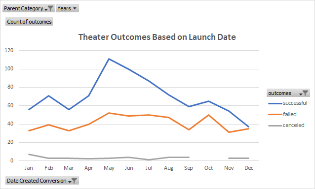
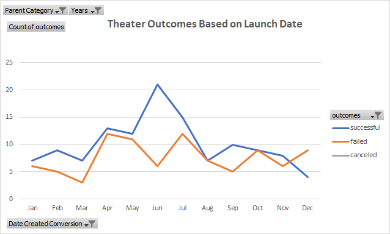
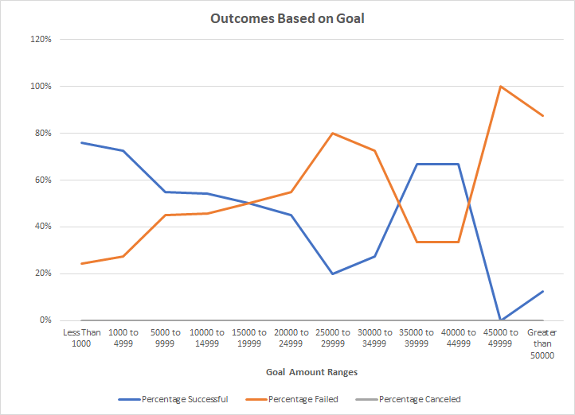

# Kickstarting with Excel

## Project Overview

This project entails analyzing a dataset of Kickstarter campaigns for a playwright who had a play come close to it's fundraising goal amount.  The playwright would like a recommendation as to when the campaign is launched and what fundraising goal amounts yield successful campaigns.  The analysis will include visualizations to assist in understanding the results. 

### Purpose

The purpose of the project is to analyze Kickstarter campaigns to determine if a theater campaign's launch date and monetary goals for plays impacted the success or failure of the campaign.

## Analysis and Challenges

### Analysis of Outcomes Based on Launch Date

The category of theater campaigns was analyzed for all available year ranges (2009-2017) to determine if the launch date would have impacted the success or failure of the campaign.  The first step in the analysis after reviewing the raw the data was to begin dividing the Category and Subcategory column into two distinct new columns using Excel's text to columns functionality. Next, it was necessary to convert the Unix timestamp in the launched_in column into a more human readable format.  A new column was created and Excel's Year function was employed successfully to convert the Unix timestamp to a user friendly year.

A pivot table was then created to allow for filtering of Parent Categories and Years.  Placing outcomes in the columns and date created conversion in the rows set the structure for the usage of count of outcomes as our values.  It was then necessary to filter the Parent Category to "theater" as the project asked for the analysis for just theater outcomes by launch date.

Now it was possible to graph the information contained in the pivot table with the requested line graph.  From here we can easily see some overall trends.

With the graph established, it was easier to visualize any shifts in the success of theater campaigns by filtering on specific years or a range of years within the pivot table.  It became evident that several years contained no or very minimal data that impacts the overall results.  When further filtering the pivot table for the range of years 2014 through 2016 when almost all of the theater data is derived, a shift in results occurs.

### Analysis of Outcomes Based on Goals

To analyze outcomes of the subcategory "plays" and the impact of their campaign goal amounts, we start by extracting data into a new sheet to categorize them within goal ranges.  The COUNTIFS() function was utilized to populate columns of the number of successful, failed and canceled plays from the Kickstarter data set.  From there, it is possible to sum all the campaigns within each goal range to create the percentage of successful, failed and canceled campaigns.  Now, it is possible to visualize the percentage of successful, failed and canceled campaigns by their goal amount ranges.

### Challenges

Upon the creation of the line graph for the "Outcomes Based on Goals", it was apparent that there was a problem with data it was generated from.  The lines were relatively flat. The numbers within the number of successful and failed columns looked too similar and seemed high.  To try to validate that, I went back to the Kickstarter data sheet and began filtering that data down for the first two goal amount ranges.  This confirmed that the data in the aforementioned columns was indeed incorrect.  I began reviewing the COUNTIFS function to try to validate if it was used properly within the cells.  I had originally created the COUNTIF() for the range "less than 1000" and copied that formula into all subsequent cells of the successful and failed columns.  I then changed the amounts in each formula to match the range for that particular row.  However, I now discovered that while I changed the dollar amounts, I did not update the lesser than and greater signs appropriately.  After adjusting these, the graph looked more reasonable.

## Results

Overall, the number of campaigns launched begins to escalate after March and peaks in May.  There is a steady decline in campaigns until September where we see a brief increase in October before continual declines through the remainder of the year.  Successful campaigns follow this same trajectory throughout the year.  Interestingly, failed campaigns follow a slightly different path.  Failed campaigns do not decrease in the same pattern as successful campaigns after the month of May.  Instead they plateau until September before reaching their peak in October and falling again.  Therefore, it is recommended that for the most successful campaign it should be launched in May.  However, there is still a greater degree of success than failures provided that campaigns are launched before September.  If we were to further filter down into the years that actually contain theater campaigns, 2014 to 2016, we see that June is the best month to launch a campaign and December is the worst month to launch a campaign.

The greatest percentage of successful play campaigns are those with lower goals.  Campaigns with goals of less than $15,000 have a greater chance of success.  Once the goal amount reaches $15,000 or higher there are more failed campaigns than successful.  It is best to keep the goal amount less than $5,000 for the greatest degree of success.

The data sets used do have limitations.  The outcomes by launch date was not required to further drill down into the subcategory of plays.  Since the ultimate goal is to see how play campaigns fared, it would be advisable to further filter down from the Parent campaign of "theater".  In addition, Kickstarter data from several different countries were used in this analysis.  The analysis could be further enhanced if we considered only using data in the country that a new campaign would be launched.

In addition to adding plays and countries to our analysis, different charts such as a cluster bar chart can also aid in the visualization of the data.
